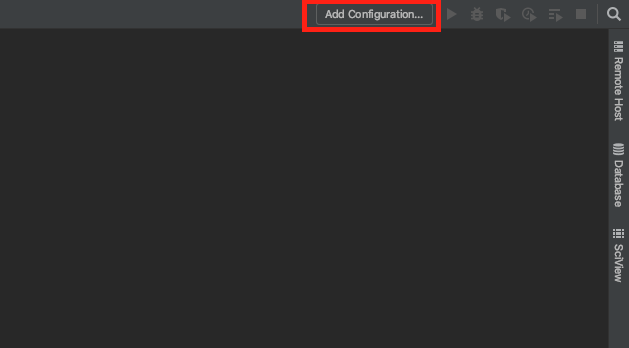
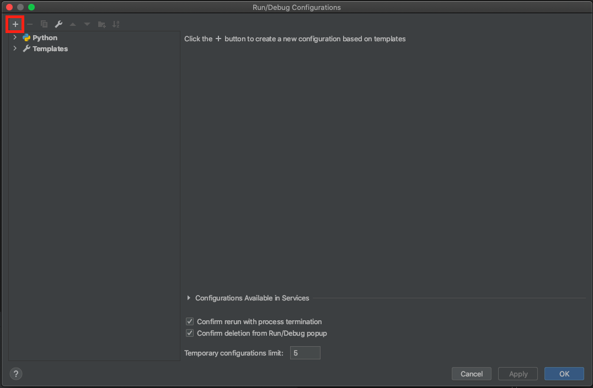
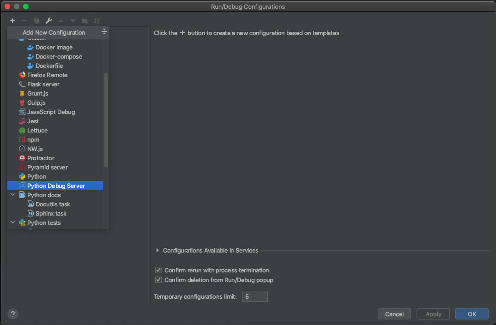
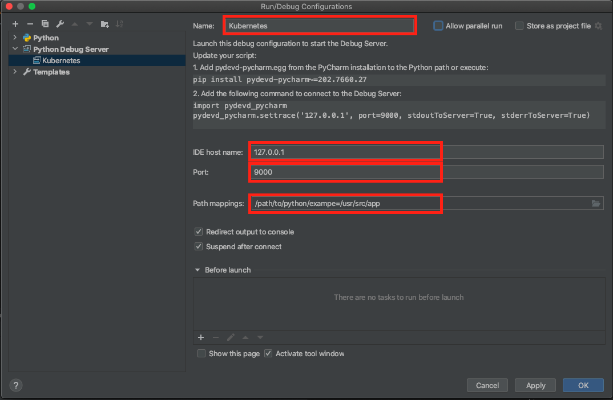

# Python remote debugging on Kubernetes

By the end of this exercise, you should be able to:

 - Remote debug an example python code on a kubernetes cluster

## Download the python example from github

1.  On your Windows Workstation download the python example from

     ```
     https://github.com/ckaserer/python-k8s-hello-world
     ```

## Configure the Remote Debugger in PyCharm Pro

1. Open the python example in PyCharm

2. Click on "Add Configuration" on the top right corner to open the debugger configuration window.

 

3. Click the plus on the top left corner to add a debugger.

 

4. Select "Python Debug Server"

 

5. Configure the Python Debug Server: name "Kubernetes", IDE Host name "127.0.0.1", port "9000" and the path mappings through the folder icon on the right.

 

6. Click "Apply" and "OK" to save and close the window.

## Run the code on kubernetes

1. Start the debugger in pyCharm Pro

2. Run okteto

   ```
   okteto up
   ```
3. Start the application

   ```
   python app.py
   ```

4. You should be promted to the debugger in pyCharm. Please set a breakpoint at the hello world message.

5. In a seperate Terminal curl http://127.0.0.1:8082. This should stop your debugger at the break point you have set in the previous step.

6. Now try to alter the message in your application and curl the endpoint again. Did it update the application to the new message?

7. To stop the application press CTRL+C in the window running the python application in the foreground.

   ```
   CTRL+C
   ```

8. Once your application has stopped you can stop okteto

  ```
  okteto down
  ```

## Conclusion

At this point, we have successfully run a python application on your kuberenetes cluster and debugged it remotely in your local PyCharm Pro IDE on your windows machine.